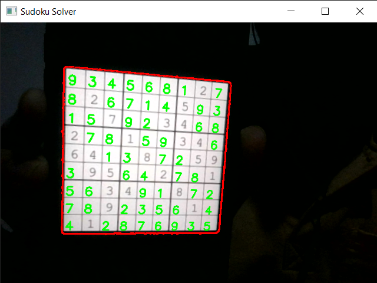

# Sudoku Solver     



## Description

An augmented reality 9x9 Sudoku solver made with OpenCV, Python, and TensorFlow/Keras.


## Run locally

**Requirement:** *Python, Numpy, ,  OpenCV, Tensorflow (Keras) and Scikit-learn.*

> Note: No need to train model for digit recognition. As `digitsOCR` contains the trained neural network model for recognizing digits (0-9).

Just run

```
python3 app.py
```

## Acknowledgements and References

Here are some of the resources I used while working on this project:

- https://www.youtube.com/watch?v=QR66rMS_ZfA
- https://www.youtube.com/watch?v=iV6poGLPTkk
- https://www.youtube.com/watch?v=cOC-ad0BsY0
- https://www.cs.mcgill.ca/~aassaf9/python/sudoku.txt (sudoku solver)
- https://medium.com/mlearning-ai/augmented-reality-sudoku-solver-part-ii-cdfc035a415c (processing)
- https://medium.com/analytics-vidhya/opencv-perspective-transformation-9edffefb2143 (perspective transformation)
